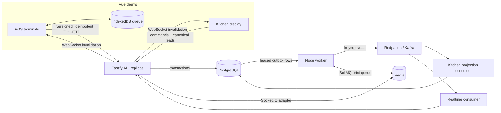

# Restaurant POS — Offline and Distributed Systems Demo

[](https://github.com/vadzzim/restaurant-pos/actions/workflows/ci.yml)

A working restaurant point-of-sale built around the failure modes that matter in production:
terminals go offline, operators race on the same order, HTTP requests and Kafka events are
delivered more than once, and downstream systems fail after an order is committed. This is a
portfolio engineering system, not a commercial product.

**88-second recorded demo** — real browser, database, Redis and Redpanda; no mocked screens. It
shows POS → kitchen delivery, offline queue drain, an optimistic-concurrency conflict, and outbox
recovery. The recording is reproducible with one command: [`pnpm demo:record`](docs/demo.md).

https://github.com/user-attachments/assets/58af79db-5a92-4409-9f6c-73a1e40c456b

## Engineering problems demonstrated

| Production requirement         | Implemented mechanism and evidence                                                                                                                                                                                                            |
| ------------------------------ | --------------------------------------------------------------------------------------------------------------------------------------------------------------------------------------------------------------------------------------------- |
| Vue client architecture        | Vue 3 + Pinia provide the POS, Kitchen Display, debug, and guided-demo surfaces; domain and sync behavior remain testable TypeScript modules ([web app](apps/web/src))                                                                        |
| Offline-capable POS            | Service-worker shell plus a durable IndexedDB mutation queue; optimistic state is projected from server state + pending mutations ([ADR 002](docs/adr/002-offline-first.md), [ADR 017](docs/adr/017-service-worker-scope.md))                 |
| Reconnect synchronization      | Per-order FIFO drain; transient failures pause, while a 409 halts that order and blocks its tail for explicit Discard/Rebase ([sync engine](apps/web/src/sync/engine.ts))                                                                     |
| Concurrent terminals and races | Every command carries the version it was built against; the API uses an atomic `UPDATE ... WHERE version = expectedVersion`, never read/compare/write ([ADR 003](docs/adr/003-optimistic-concurrency.md))                                     |
| Idempotent mutations           | Client-generated mutation ID + request hash; the idempotency row commits in the same PostgreSQL transaction as the business effect, and key reuse with different content is rejected ([ADR 004](docs/adr/004-idempotency.md))                 |
| Transactional integrity        | Order mutation, new version, processed-mutation record, and domain event commit together; validation or conflict rolls the unit back ([mutation handler](apps/api/src/modules/orders/application/mutation-handler.ts))                        |
| Database-to-broker consistency | Transactional outbox removes the unsafe dual write; publishing occurs after commit ([ADR 005](docs/adr/005-transactional-outbox.md))                                                                                                          |
| At-least-once event processing | Redpanda/Kafka topic keyed by `orderId`; consumers record `(eventId, consumerName)` with their projection to make redelivery harmless ([ADR 009](docs/adr/009-kitchen-projection.md))                                                         |
| Retries and dead letters       | Leased outbox claims, exponential backoff, attempt ledger, PostgreSQL dead-letter state, and manual recovery controls ([ADR 010](docs/adr/010-db-outbox-retries.md))                                                                          |
| Realtime POS and KDS           | Socket.IO broadcasts from a Kafka consumer; reconnect is correctness-preserving because clients refetch canonical state before resuming live events ([ADR 006](docs/adr/006-realtime-consumer.md))                                            |
| Multi-instance WebSockets      | Socket.IO Redis adapter fans events across stateless API replicas; `pnpm verify:multi` proves a write through replica A reaches a socket on replica B                                                                                         |
| Async device effects           | BullMQ on Redis owns print scheduling/retry; PostgreSQL owns the durable outcome and reconciliation state ([ADR 014](docs/adr/014-print-job-queue.md))                                                                                        |
| Production failure recovery    | `/demo` can pause the publisher, fail the printer, duplicate a mutation/event, and force a conflict; `/debug` exposes the resulting backlog, retries, and dead letters                                                                        |
| Observability                  | Correlated structured logs plus bounded-label Prometheus HTTP, mutation, WebSocket, outbox, and print metrics at [`/metrics`](http://localhost:3000/metrics); alert rules cover old backlog and dead letters ([guide](docs/observability.md)) |
| Verification                   | 507 Vitest tests, real PostgreSQL/Redis/Redpanda integration round trips, and a production-build Playwright flow run in CI; `pnpm verify:multi` separately proves the two-replica path ([workflow](.github/workflows/ci.yml))                 |

The deliberately missing pieces are documented too: consumer-side dead-letter topics, distributed
tracing, rate limiting, and production auth are not disguised as finished work
([known problems](docs/known-problems.md)).

## Architecture at a glance



Three independently runnable processes — `web`, `api`, and `worker` — sit over PostgreSQL,
Redpanda, and Redis. See the [full data-flow and scale analysis](docs/architecture.md), the
[nineteen ADRs](docs/adr/README.md), and the clause-by-clause
[definition of done](docs/definition-of-done.md).

## Requirements

- Node.js 24+
- pnpm 10+
- Docker with Compose

## Start

```bash
pnpm install
cp .env.example .env
docker compose up -d
pnpm dev
```

PowerShell equivalent: `Copy-Item .env.example .env`. Compose can start the infrastructure without
the file because its demo defaults are explicit, but local application processes read `.env`.

## Verify

```bash
pnpm lint && pnpm typecheck   # static checks
pnpm test:unit                # the domain rules and the browser stores; no infrastructure needed
pnpm verify:integration       # Compose up, the PostgreSQL- and broker-backed suites, teardown
pnpm test:e2e                 # the same, plus the apps, plus §21's browser test
pnpm verify:multi             # the production images, two API replicas, and §19.10
```

`pnpm verify:integration` is the reproducible one: it brings the infrastructure up, waits for the
healthchecks, runs the suites that need it — including a real round trip through Redpanda and one
through the BullMQ print queue on a real Redis — and
tears down **only the containers it started**, so a demo you already have running survives. Its full
output lands in `.verify-output/integration.log`. Pass `--keep` to leave the containers up. CI runs
this same command and declares no service containers of its own.

`pnpm test:e2e` is §21's last line: one Playwright test that crosses every process — POS-1 opens an
order, adds an item and sends it to the kitchen; the kitchen display shows the ticket, marks it
PREPARING, and the POS follows without asking for anything. The script owns the whole lifecycle
(Compose, migrate, seed, build, an API and a worker as child processes) and Playwright serves the
**production** bundle on `:4173` — since M17 that is a different build from `pnpm dev`, and it is the
one the image ships. Output in `.verify-output/e2e.log`. An API already listening on `:3000` is
reused rather than duplicated, so this is safe to run against a demo you have up. It also installs
the Chromium Playwright drives — `pnpm install` does not, and that binary is the one prerequisite
this repository cannot express in `package.json`.

`pnpm test:e2e:run` runs the spec alone against a stack you are already running, and takes
Playwright's own flags — `--headed`, `--debug`, `--ui`. It expects `apps/web/dist` and the browser
to be there already: `pnpm exec playwright install chromium` once, then
`pnpm -F @pos/web build && pnpm -F @pos/web preview`. ADR 018 records the rest.

`pnpm verify:multi` is the §22 one. It builds the three production images
(`apps/{api,worker,web}/Dockerfile`, multi-stage and non-root — ADR 016), brings up
`docker-compose.multi.yml`: **two addressable API replicas** behind the Redis adapter, one worker,
and the built web on nginx in front of both. Then it asserts §19.10 — a mutation applied through
replica A reaches a WebSocket client attached to replica B. Output in
`.verify-output/multi-instance.log`; `--keep` leaves the stack up, with the replicas on
`:3001` and `:3002` and the browser entry point on http://localhost:8081.

Two things look wrong in a two-replica run and are not: `activeWebSocketConnections` on `/debug` is
that instance's own sockets, and so is the in-process counter registry, so the page reports
whichever replica answered. The shared counters in Redis are the ones that aggregate.

## The demo

For the concise review path, watch the [recorded demo](https://github.com/user-attachments/assets/58af79db-5a92-4409-9f6c-73a1e40c456b). To
regenerate it against a clean, real stack, run `pnpm demo:record`; the script owns the same
Compose/migrate/seed/build/process lifecycle as E2E and writes a local source recording
deterministically. See [`docs/demo.md`](docs/demo.md) for the exact sequence and publishing format.

Open **http://localhost:5173/demo**. It carries all ten §19 scenarios click by click — what has to
be off before each one, what to press, and what to watch. The short version, in the order worth
showing:

1. **Normal flow** — one order from the first tap to payment, across a till and a kitchen display.
   The till never calls the kitchen: the ticket arrives through Postgres, the outbox, Redpanda and
   the consumer's projection.
2. **Offline, then a clean sync** — a till with no network **creates** an order and takes four
   mutations; reconnect drains them in order and the pending count reaches zero.
3. **Conflict, and the queue behind it** — the first mutation gets a 409, the rest go `BLOCKED` and
   are never sent, and the operator chooses Discard or Rebase. The one most systems get wrong.
4. **The publisher stops; the order does not** — pause the outbox publisher, take an order, watch
   the backlog grow on `/debug`, resume, watch it drain. The argument for the outbox, made visible.
5. **The printer is down** — retries with backoff, a visible dead-letter, a manual retry that
   succeeds. The order was never affected.

The remaining five — a duplicate mutation, a reused id with a new payload, a duplicated Kafka event,
two kitchen displays racing on one ticket, and a cross-replica broadcast — are on the same page.
The last needs `pnpm verify:multi --keep`.

Two setup traps. The seven client-side simulator controls are module refs in **one tab**: arm on
`/debug` and walk to the POS in that same window, never a second tab. And a control left armed will
fail the next scenario the way a broken broker would — `/demo` lists what must be off before each.

## Operational switches

All eleven §18 simulator controls are on `/debug`, grouped by where the switch lives (ADR 015). The
four server-side ones are rows in PostgreSQL, so they are also reachable from a terminal, and a
running worker picks a change up without a restart — the CLI and the page drive the same state:

```bash
pnpm -F @pos/worker outbox status | pause | resume | delay 3000
pnpm -F @pos/worker printer status | fail | fix | retry <orderId>
```

`printer fail` makes `POST /api/printer/print` answer 503, which is how scenario §19.9 drives a
print job into its dead-letter state; `printer retry` puts a dead-lettered ticket back on the queue.

## URLs

- POS: http://localhost:5173/pos/pos-1 and http://localhost:5173/pos/pos-2
- Kitchen: http://localhost:5173/kitchen
- Debug and the §18 simulator: http://localhost:5173/debug
- Demo script: http://localhost:5173/demo
- API liveness: http://localhost:3000/api/health/live
- API readiness: http://localhost:3000/api/health/ready — PostgreSQL only; a broker outage leaves
  this green and orders still accepted (ADR 011)
- Prometheus metrics: http://localhost:3000/metrics
- Dependencies: http://localhost:3000/api/debug/dependencies
- Redpanda Console: http://localhost:8080

With `pnpm verify:multi --keep` running, the same screens are served by nginx in front of both
replicas: POS http://localhost:8081/pos/pos-1, kitchen http://localhost:8081/kitchen, and each
replica reachable on its own at http://localhost:3001 and http://localhost:3002.

The optional Compose `app` profile is a development convenience that mounts the source tree and
runs `tsx`; `docker-compose.multi.yml` is the opposite — the built images, no mounts. They use
different service names for that reason and can be told apart at a glance. Local `pnpm dev` is the
supported workflow; do not run the `app` profile alongside host-side `pnpm dev` in the same
checkout.
