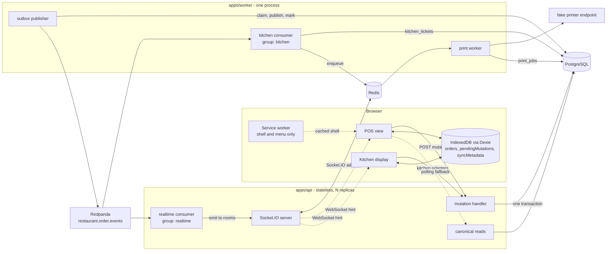
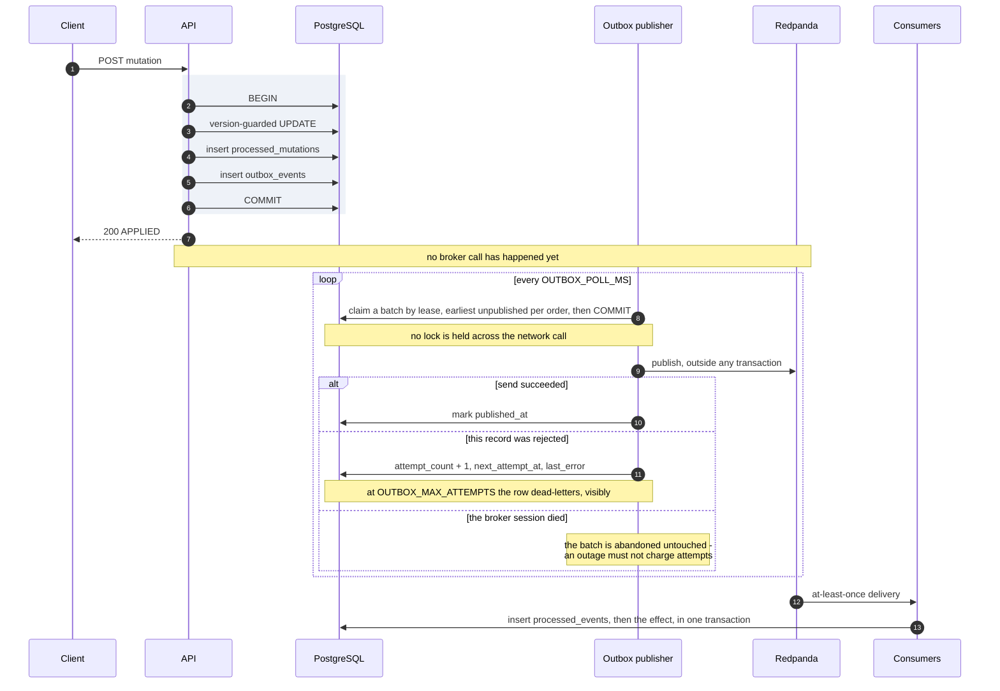

# Architecture

Three processes, one PostgreSQL, one broker, one Redis. Everything interesting in this repository
is a consequence of two facts: **a terminal may be offline when it decides something**, and **a
database commit and a broker publish cannot be one transaction**.

Decisions are recorded in [`docs/adr/`](adr/README.md) and are not re-argued here — this document
draws the picture and links to the argument. Requirements are `docs/spec.md`; the honest list of
what is wrong is [`docs/known-problems.md`](known-problems.md).

## The system



**What the arrows mean.** Solid arrows are the write path and the event path; dotted arrows carry
no data the client trusts. A WebSocket frame is a _hint to refetch_, never the state itself
(§13) — which is why the polling transport of ADR 008 is a drop-in replacement that costs latency
and nothing else.

**Three processes and no more** (ADR 001). The API is stateless and replicated; the worker is
single and owns the outbox lease and the print queue; the browser is the third, and it is the only
one that can be offline for minutes at a time.

**Which dependency is hard.** PostgreSQL is the only one (ADR 011). Redpanda down means the outbox
fills and screens stop updating live — **orders are still accepted**, which is the sentence the
whole design exists to make true. Redis down means cross-replica broadcast and printing degrade.
`/api/health/ready` therefore checks PostgreSQL and nothing else, by rule and not by omission.

## The write path

Every order change — including the two kitchen transitions — is one
`POST /api/orders/:orderId/mutations` carrying a client-generated `mutationId` and the
`baseVersion` it was built against (§5). There is deliberately no `POST /api/orders`: creation is
`CREATE_ORDER` at `baseVersion: 0` against a client-generated `orderId`, so there is no unprotected
write anywhere in the system (ADR 004).

[`runMutation`](../apps/api/src/modules/orders/application/mutation-handler.ts:129) is one
transaction, and its branches are in this order — the order is the design:

1. **Tenant guard** — the order exists under another restaurant → `403 CROSS_TENANT_MUTATION`.
2. **Idempotency hit, same request hash** → `ALREADY_APPLIED` with the stored result.
3. **Idempotency hit, different hash** → `409 MUTATION_ID_REUSED`. The cached result is never
   returned; that would confirm an operation the server never performed (ADR 004).
4. **Missing order for a non-create** → `404 ORDER_NOT_FOUND`.
5. **`decide()` says conflict** → roll back, log to `conflict_log`, answer `409` with the canonical
   order (§8, ADR 003).
6. **`decide()` says already applied** → the transition is a repeat.
7. **Apply**, under the version-guarded `UPDATE ... WHERE id = $1 AND version = $2`. Zero rows
   affected is a conflict; the read before it is explicitly _not_ a guard.
8. **Insert `processed_mutations`** in the same transaction as the effect.
9. **Insert `outbox_events`** in the same transaction as both.

Steps 8 and 9 are what make the two hard guarantees atomic: a duplicate cannot duplicate an effect,
and an applied order cannot exist without the event that announces it.

The business rules themselves are not here. They are [`decide()`](../packages/domain/src/decide.ts)
in `@pos/domain`, a pure function of `(snapshot, command)` — the whole of §8 in one place, and the
same function the browser imports, so an optimistic projection never draws a mutation the server
would refuse.

## Offline sync, and the branch where it halts

The client never waits for the server. The screen renders
`projectQueue(canonicalSnapshot, queuedMutationsForThatOrder)` — a pure fold, derived on read and
never stored, so a reload reproduces it exactly (ADR 002). The durable fact is the queue row, keyed
by a `mutationId` that is **never regenerated** except by an explicit rebase (ADR 013).

```mermaid
sequenceDiagram
    autonumber
    participant U as Operator
    participant S as POS screen
    participant D as Dexie queue
    participant E as Sync engine
    participant A as API

    U->>S: add Burger, add Coffee, change quantity
    S->>D: append PENDING rows
    Note over D: baseVersion is stamped from the<br/>projected version, not the canonical one
    S-->>U: optimistic view, no round trip

    Note over E,A: reconnect
    E->>D: read the group for this order
    E->>A: send the first mutation, one at a time
    alt applied
        A-->>E: 200 APPLIED, canonical order
        E->>D: cache the snapshot, then delete the pending row
        E->>A: send the next one
    else conflict, 409
        A-->>E: 409 CONFLICT, canonicalOrder, serverVersion
        E->>D: mark this row CONFLICT, the rest of the order BLOCKED
        Note over E: the blocked tail is never sent;<br/>other orders keep syncing
        S-->>U: canonical state beside the local intent
        U->>S: Discard or Rebase
        alt Discard
            S->>D: delete the halted group in one transaction
        else Rebase
            S->>A: re-issue with a new mutationId at the current version
            Note over S,A: one at a time - each success advances<br/>the version the next is stamped at,<br/>and any step may conflict again
        end
    end
```

Three things in that diagram are load-bearing and easy to get wrong:

- **The delete comes after the cache write**, never before. The two writes are not atomic, and the
  other order leaves a crash window in which a `CREATE_ORDER` has lost its snapshot, its `orderId`
  and its `mutationId` at once — an empty till, and an operator ringing the order up twice
  (ADR 013).
- **Nothing resolves itself.** Silent auto-rebase is last-write-wins wearing a disguise (§14.1).
- **The send gate is derived, not read.** A group is sendable only if _every_ row in it is `PENDING`
  or `SYNCING`, so a crash mid-halt still refuses it. The labels are what the operator reads; the
  derivation is what the engine obeys — [`isSendable`](../apps/web/src/sync/engine.ts:118).

## The outbox

A mutation must change the order and tell the rest of the system it happened. Doing both directly
is a dual write with no correct failure mode: publish inside the transaction and a broker timeout
either rolls back an order the customer watched being taken or commits after a publish the rollback
cannot recall; publish after the commit and a crash in between loses the event with no record that
it was ever owed (ADR 005).



**Three short steps, and the middle one holds no lock** (§10, ADR 010). The claim commits before
the publish; the mark is a second transaction. The topic is partitioned by `orderId` and the
publisher claims only an order's _earliest_ unpublished event, so one order's events reach the
broker in version order however the retries fall out and however many workers run.

**The retries live in PostgreSQL and not in BullMQ** — `attempt_count`, `next_attempt_at`,
`last_error`, `dead_lettered_at` are columns on the same row as the payload. A job and a row are
two records of one fact (ADR 010). Two rules fall out, and both are defended by tests: _an attempt
means this event failed_ — a paused publisher, an expired lease and a vanished broker all leave the
row exactly as they found it — and _a reclaim is not an attempt_, it increments `reclaim_count`,
because a worker dying says nothing about the event.

## The two consumers, with honestly different guarantees

|                   | kitchen consumer                                                           | realtime consumer                                                 |
| ----------------- | -------------------------------------------------------------------------- | ----------------------------------------------------------------- |
| Runs in           | `apps/worker`                                                              | **`apps/api`**, every replica, one shared group                   |
| Side effect       | a row in `kitchen_tickets`                                                 | `io.to(rooms).emit`                                               |
| Guarantee         | genuinely idempotent — the dedup marker and the projection commit together | at-least-once, with a **stated** crash window                     |
| A duplicate event | `processed_events` catches it, the projection is unchanged                 | may re-emit a hint; the client refetches and gets the same answer |

The kitchen consumer writes a **real read model** on purpose (ADR 009): a consumer that only logged
or only emitted could claim idempotency, but nothing observable would distinguish "handled once"
from "handled twice". It also carries a version guard separate from the dedup marker —
deduplication catches the _same_ event arriving twice, the guard catches an _older_ event arriving
after a newer one.

The realtime consumer is in the API because Socket.IO's connections are there (ADR 006). Every
replica joins the same group, so each event is handled once, by whichever instance holds the
partition; that instance emits, and the **Redis adapter** fans the broadcast out to sockets held by
the others. `pnpm verify:multi` proves exactly that, against two real replicas behind nginx. The
emit is not transactional and does not pretend to be: the consumer commits `processed_events` and
_then_ emits, so a crash in between loses a hint — which the next reconnect-and-refetch repairs
(§12.2).

**The kitchen commands from that lagging projection** (ADR 012). A ticket's only version is
`source_event_version`, so a kitchen display sends a `baseVersion` that may be stale, and a `409` is
an accepted, visible outcome rather than something engineered away.

## Data

Fifteen tables. The ones that carry the guarantees: `orders` (the `version` column), `order_items`,
`processed_mutations` (`mutationId` primary key, plus `request_hash`), `outbox_events` (payload,
lease, retry state), `processed_events` (`unique(event_id, consumer_name)`), `kitchen_tickets` (the
projection), `conflict_log`, `print_jobs`. The rest are reference data and the four demo control
rows. Schema and migrations are Drizzle; the concurrency-sensitive statements are explicit SQL, so
their guarantees can be inspected rather than trusted (ADR 007).

## Scale

Documented, not implemented. §25 rules out Kubernetes, Terraform and multi-region; what follows is
the design conversation, with a clear line between **what this repository already does** and **what
would have to be built**.

### Already true here

- **The API is stateless and replicated.** No session affinity, no in-process order state; two
  replicas run in `docker-compose.multi.yml` and `pnpm verify:multi` asserts a cross-replica
  broadcast. The only in-process state is the §20 counters, and `/debug` says out loud that they
  are one instance's.
- **WebSocket fan-out is already adapter-based.** The Socket.IO Redis adapter, with rooms keyed by
  restaurant, order and kitchen. Adding a replica adds capacity without changing the code.
- **The event topic is partitioned by `orderId`**, which is the correct key: ordering is needed per
  order and nowhere else. Kafka guarantees ordering only inside a partition, and this repository
  makes no claim about global ordering.
- **Backpressure at the broker boundary is already a queue you can see.** The outbox is a table; its
  depth and its oldest unpublished row are on `/debug`, and consumer lag per group comes from a
  Kafka admin client.

### What 20 000 restaurants would need

- **Partition count.** One partition per order is absurd; the count is chosen from throughput and
  from how many consumer instances you want in a group, since a partition is the unit of
  parallelism. With `orderId` as the key, load spreads evenly — there is no natural hot key, unlike
  `restaurantId`, which would put a chain's flagship store on one partition and pin it to one
  consumer. The cost is that cross-order ordering does not exist, which nothing here needs.
- **A hot partition is still possible** on a poison order retried indefinitely — `reclaim_count` on
  the publish side is the visible symptom, and a consumer-side dead-letter topic is the real answer.
  It is not built (`known-problems.md`).
- **PostgreSQL read/write scaling.** Reads first: the canonical order read and the kitchen
  projection read are the hot paths, both are single-row-plus-children, and both can go to replicas
  with the write path staying on the primary — the version guard makes a stale read harmless, since
  a mutation built on one simply conflicts. Writes scale by **tenant partitioning**: `restaurantId`
  is on every table already, so declarative partitioning by a hash of it is a schema change and not
  an application change. Beyond one machine, the same key shards.
- **Connection pooling** stops being optional at that replica count — PgBouncer in transaction mode,
  which is compatible with everything here, because there is no session-level state.
  `FOR UPDATE SKIP LOCKED` and explicit transactions work unchanged.
- **The outbox publisher is the one singleton left.** It scales by claiming: the lease
  (`claimed_by`, `claim_until`) already permits N publishers, and `SKIP LOCKED` keeps them off each
  other's rows. Partitioning the claim query by a hash of `restaurantId` would give each publisher a
  slice and remove the contention entirely. The print worker needs the same treatment — today it is
  fleet-wide and single-device by admission.
- **Rate limits and admission control** do not exist. A per-terminal token bucket at the mutation
  endpoint is the obvious first one; the second is a cap on queue drain rate per terminal, because a
  terminal returning from an hour offline sends its whole queue as fast as the server answers.
- **Observability.** Structured pino logs already carry `traceId requestId restaurantId terminalId
orderId mutationId eventId`. At this size the counters move from a per-instance registry to
  Prometheus (§20 calls it optional), the correlation fields become real distributed tracing across
  the HTTP → outbox → Kafka → consumer hop, and the two numbers worth alerting on are **outbox
  backlog age** and **consumer lag per group** — both already computed, neither currently alerting.
- **Multi-region** is the one that changes the model rather than the deployment. The order aggregate
  is single-writer by version, so a region-local primary per restaurant with asynchronous
  replication elsewhere is coherent; a global primary is not, because the whole point of the
  optimistic scheme is a short round trip. Cross-region event flow would be a mirrored topic, and
  the kitchen projection stays regional. That is a redesign, not a configuration.
- **A real payment system** would not use this shape. `PAY` here is a status transition; a real one
  is an external effect with its own idempotency key, its own retry ledger and its own
  reconciliation — structurally the print job (ADR 014) rather than the order mutation, because the
  effect happens outside the database and no transaction can contain it. The order would carry a
  payment _intent_, and the authoritative record would be the provider's.
